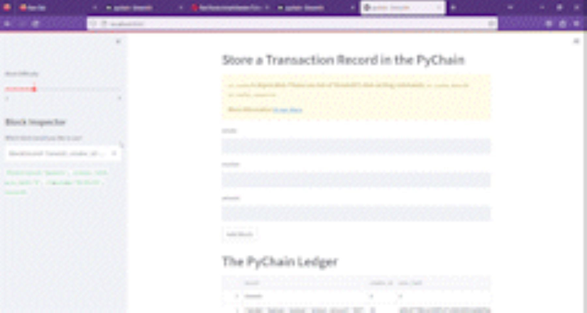

# blockchain-ledger
# Algorithmic Trading Bot

## Description

## Table of Contents

- [Algorithmic Trading Bot](#algorithmic-trading-bot)
    - [Description](#description)
    - [Table of Contents](#table-of-contents)
    - [1. Installation](#1-installation)
    - [2. Usage](#2-usage)
    - [3. License](#3-license)
    - [4. Contributing](#4-contributing)
    - [5. Tests](#5-tests)
    - [6. Deployment](#6-deployment)
    - [7. Contact](#7-contact)
    - [8. Results](#8-results)

## 1. Installation

If you would like to clone the repository, type "git clone https://github.com/arianamoreno13/blockchain-ledger.git". In your terminal, with the conda dev environment activated, install the following packages and dependencies before running the algorithmic trading bot. To understand how to install these, refer to the Usage. 

## 2. Usage

- csv - Used to store data

- VS Code - Used to create and share documents that contain live code, equations, visualizations and narrative text.

- pandas - For data analysis.

- streamlit  -

- datetime - 

-hashlib -
 

## 3. License
    MIT License
Copyright (c) 2023 Ariana Moreno

Permission is hereby granted, free of charge, to any person obtaining a copy of this software and associated documentation files (the "Software"), to deal in the Software without restriction, including without limitation the rights to use, copy, modify, merge, publish, distribute, sublicense, and/or sell copies of the Software, and to permit persons to whom the Software is furnished to do so, subject to the following conditions:

The above copyright notice and this permission notice shall be included in all copies or substantial portions of the Software.

THE SOFTWARE IS PROVIDED "AS IS", WITHOUT WARRANTY OF ANY KIND, EXPRESS OR IMPLIED, INCLUDING BUT NOT LIMITED TO THE WARRANTIES OF MERCHANTABILITY, FITNESS FOR A PARTICULAR PURPOSE AND NONINFRINGEMENT. IN NO EVENT SHALL THE AUTHORS OR COPYRIGHT HOLDERS BE LIABLE FOR ANY CLAIM, DAMAGES OR OTHER LIABILITY, WHETHER IN AN ACTION OF CONTRACT, TORT OR OTHERWISE, ARISING FROM, OUT OF OR IN CONNECTION WITH THE SOFTWARE OR THE USE OR OTHER DEALINGS IN THE SOFTWARE.

## 4. Contributing

[Ariana Moreno](https://github.com/arianamoreno13)

## 5. Tests

- There is currently no tests associated with this project 

## 6. Deployment

- There is currently no live deployment of this notebook on a common server, but the user has the ability to run this notebook locally on their machine via:
    - Visual Studio Code: Run code then click on link in terminal to deploy app 

## 7. Contact

- [Ariana's Linkedin](www.linkedin.com/in/arianapmoreno)

## 8. Results

